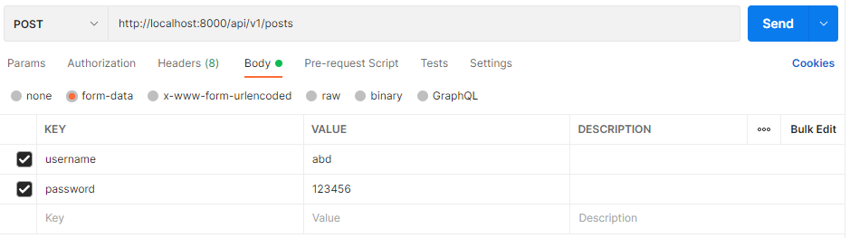
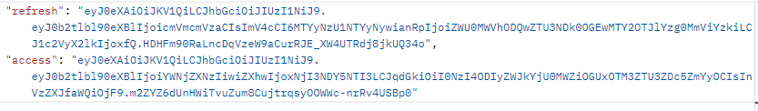
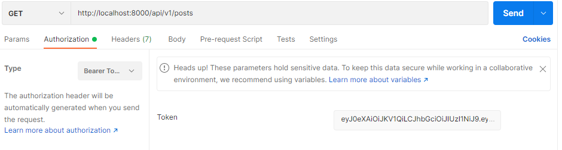
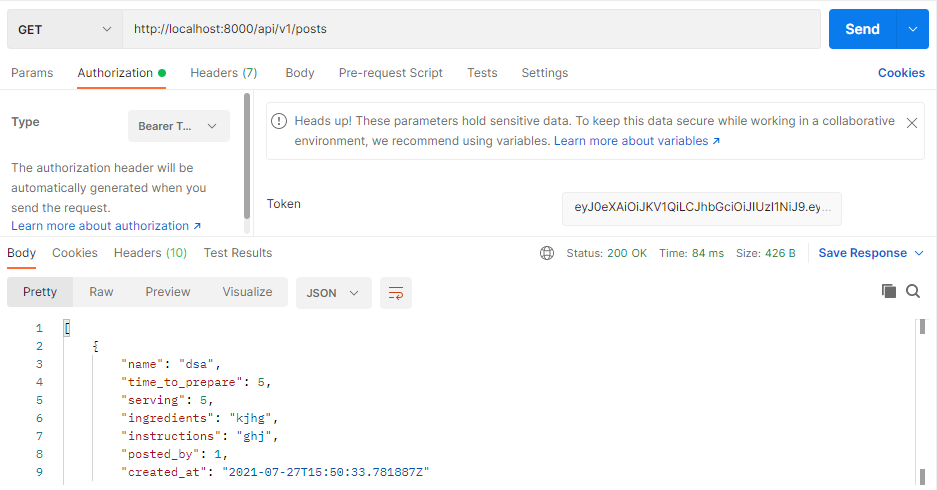

PR: [PR](https://github.com/abdalrahmansamara/permissions/pull/1)

## Testing

for the testing using Postman.

1. make a POST request, with setting the settings in the image below:

this request will return a refresh key and and access key as in the image below

the refresh key can be used to generate a new access key, and the access key can be used to access the backend API links as follows:

when pressing send, this will return the data inside the table we have

